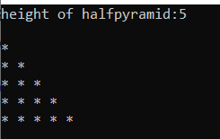
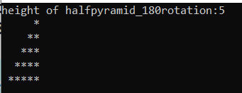
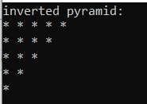
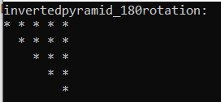
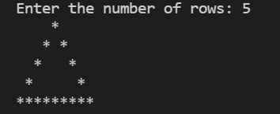

# Patterns in C++ language
A few patters using C++ language and images are:

## 1.[triangle.cpp](https://github.com/gautam32/Patterns/blob/main/Cpp/triangle.cpp)

## 2.[halfpyramid](https://github.com/gautam32/Patterns/tree/main/Cpp)

## 3.[halfpyramid_180rotation](https://github.com/gautam32/Patterns/blob/main/Cpp/halfpyramid_180rotation.cpp)

## 4.[invertedpyramid](https://github.com/gautam32/Patterns/blob/main/Cpp/invertedpyramid.cpp)

## 5.[invertedpyramid_180rotation](https://github.com/gautam32/Patterns/blob/main/Cpp/invertedpyramid_180rotation.cpp)

## 6.[rhombus](https://github.com/gautam32/Patterns/blob/main/Cpp/rhombus.cpp)

## 7.[hollow_pyramid](https://github.com/gautam32/Patterns/blob/main/Cpp/hollow_pyramid.cpp)

## 8.[inverted_hollow_pyramid](https://github.com/gautam32/Patterns/blob/main/Cpp/inverted_hollow_pyramid.cpp)

  
