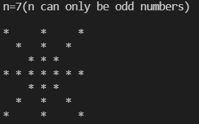
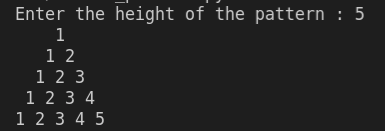
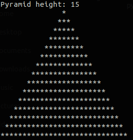

# Patterns
See what patterns are here, if you can create patterens different from these, add them here

## (1). [rectangle.py](https://github.com/gautam32/Patterns/blob/main/Python/rectangle.py)

## (2). [rhombus.py](https://github.com/gautam32/Patterns/blob/main/Python/rhombus.py)

## (3). [half_pyramid.py](https://github.com/gautam32/Patterns/blob/main/Python/half_pyramid.py)

## (4). [half_pyramid(180_rotation).py](https://github.com/gautam32/Patterns/blob/main/Python/half_pyramid(180_rotation).py)
.png)

## (5). [inverted_half_pyramid.py](https://github.com/gautam32/Patterns/blob/main/Python/inverted_half_pyramid.py)

## (6). [asterisk.py](https://github.com/gautam32/Patterns/blob/main/Python/asterisk.py)

## (7). [number_pattern.py](https://github.com/gautam32/Patterns/blob/main/Python/number_pattern.py)

## (8). [full_pyramid.py](https://github.com/gautam32/Patterns/blob/main/Python/full_pyramid.py)

